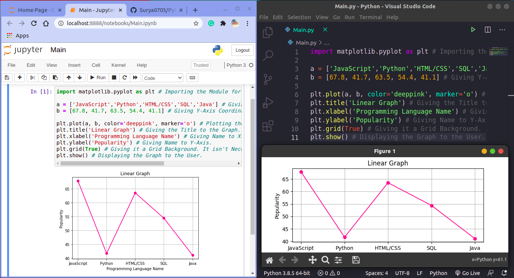

# Python_Linear_Graph
This is a Python Program that creates Linear Graph of a given Data in Python. It uses 'matplotlib' module to do so. To install that Module just type the following in your CMD/Powershell/Terminal (Assuming that You are on Windows):
```
pip install matplotlib
```
Or if you are in Linux(Ubuntu 20.04 LTS which I am using) then use:
```
pip3 install matplotlib
```
Or install according to your OS. After installation edit the Code as per the Graph you want to Plot. Also this data plotting works on both OnlineIDEs such as Google Colab, Jupyter Notebook, etc. or Installed IDEs such as Visual Studio Code, Pycharm, etc. For Normal usage just run [Main.py](Main.py) file and to run it in your Browser just use [Main.ipynb](Main.ipynb). Below is the Screenshot of My Program:


And Hope that you Liked it!
